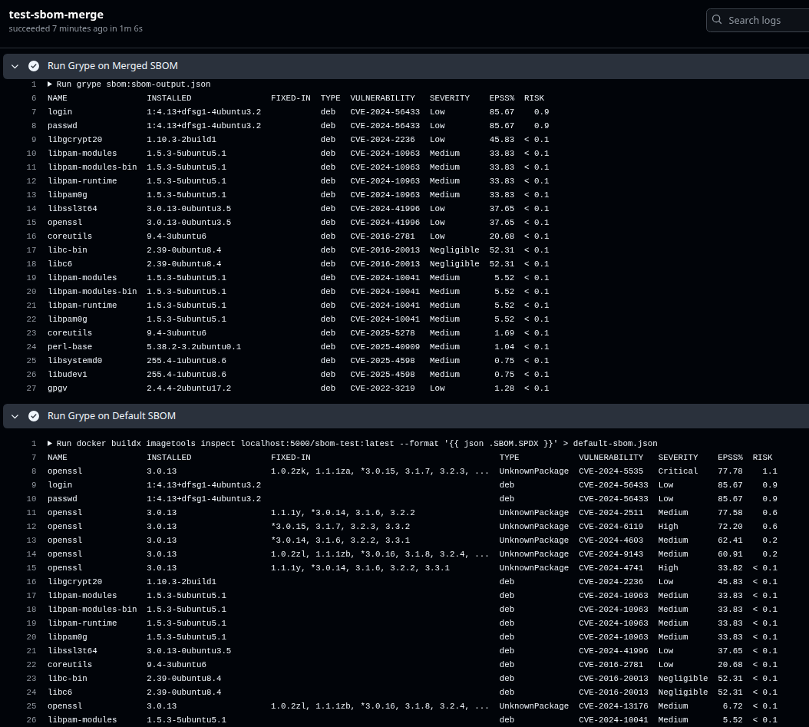

# `@wildsheepz/sbom-merge`

## Usage

### Inputs

```yaml
- uses: actions/upload-artifact@v4
  with:
    # The docker image to scan
    # Required.
    docker-image:

    # Target arch if the image is an multi-arch image
    # Optional. Default is 'linux/amd64'
    arch:

    # Filepath to write the merged sbom output to
    # Optional. Default is '.sbom-output.json'
    sbom-output-filepath:

    # Filepath to write the raw sbom output to
    # Optional. Defaults is '.sbom-raw.json'.
    sbom-raw-filepath:
```

### Outputs

| Name | Description | Example |
| - | - | - |
| `sbom-found` | Whether sbom was found with the image. 'true' if found. | `true` |
| `is-supported-format` | Whether the sbom was a supported type. 'true' if supported. | `true` |
| `sbom-raw-filepath` | Filepath the raw sbom output was written to | `.sbom-raw.json` |
| `sbom-output-filepath` | Filepath the merged sbom was written to | `.sbom-output.json` |

## Examples

### Merge SBOM for docker image

```yaml
steps:
- uses: wildsheepz/sbom-merge@main
  id: sbom-merge
  with:
    docker-image: ubuntu:latest
    sbom-output-filepath: sbom-output.json  # optional, default .sbom-output.json
    sbom-raw-filepath: sbom-raw.json        # optional, default .sbom-raw.json
    arch: linux/amd64                       # optional, default linux/amd64

- run: |-
    echo ${{steps.sbom-merge.outputs.sbom-found}}
    echo ${{steps.sbom-merge.outputs.is-supported-format}}
    echo ${{steps.sbom-merge.outputs.sbom-raw-filepath}}
    echo ${{steps.sbom-merge.outputs.sbom-output-filepath}}
    
```

### Test Build Multi Stage

See Sample Dockerfile: [test/Dockerfile](test/Dockerfile)

